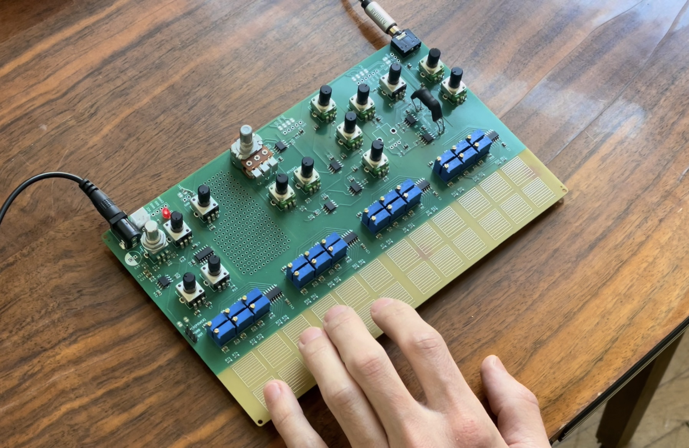

# Open Organ

A paraphonic analog synthesizer that offers tangible connections to its circuitry. Touch and moisture sensitive traces let the tunable voices flow into the shaping section. Filter, compressor, vibrato, and mixing modules are built in. Sound is also shaped by its power input, inviting musical interaction with the power source.